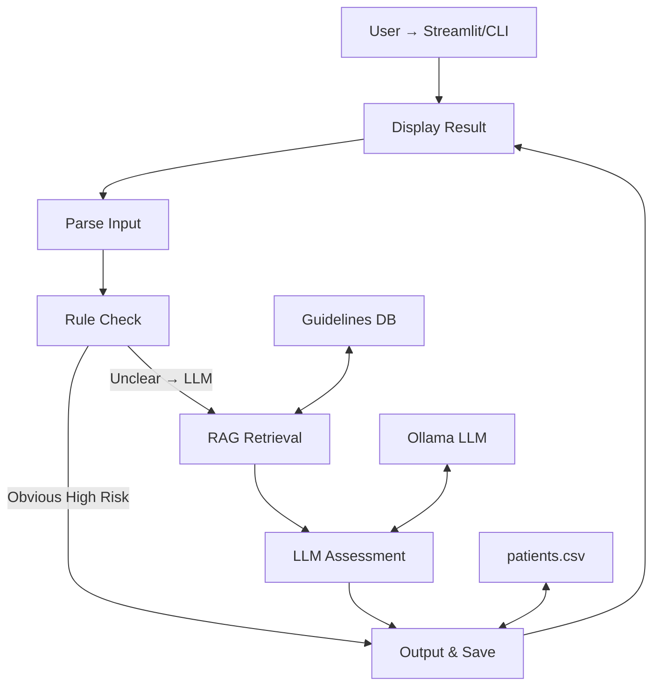
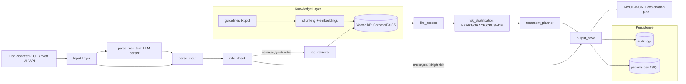
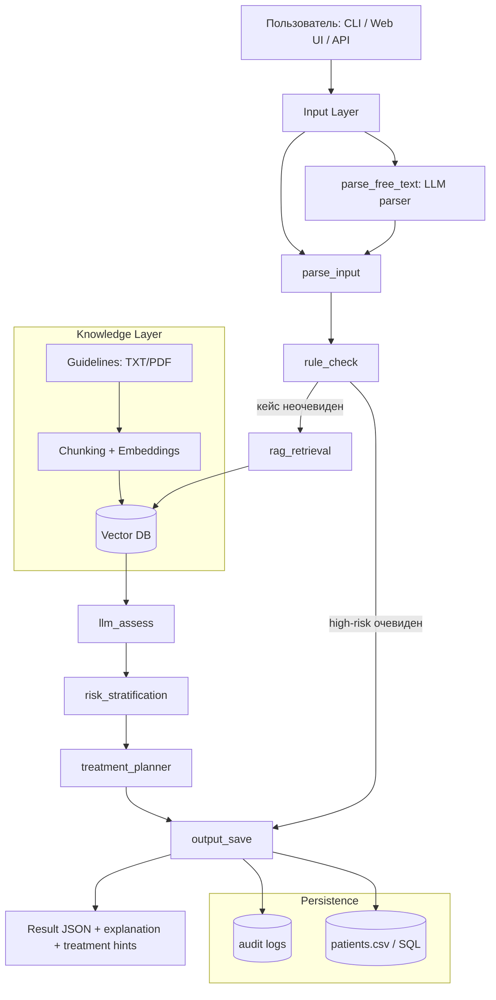

# LangGraph ACS (Console Prototype)

Прототип локальной системы первичной оценки риска ОКС (образовательный сценарий).
Текущая реализация запускается из консоли и сохраняет результаты в CSV/JSON.

## Что реально реализовано

- Консольный запуск через `python -m src.cli.main`.
- Агентный workflow на `LangGraph` с узлами:
  - `parse_input`
  - `rule_check`
  - `rag_retrieval`
  - `llm_assess`
  - `output_save`
- Rule-based базовая оценка риска (`src/medical/rules.py`).
- Локальный LLM через `Ollama` (`src/core/tools.py`).
- Локальный RAG в виде retrieval по `.txt` документам (`data/guidelines/*.txt`).
- Сохранение истории пациентов в `data/patients.csv`.
- A/B режим сравнения двух моделей (`--mode ab`).
- Fallback-режим без LLM (если модель недоступна и не указан `--require-llm`).

## Что пока не реализовано

- Web UI (Streamlit/веб-приложение).
- Векторная БД (Chroma/FAISS) и embedding-retrieval.
- Автоматический разбор полностью свободного текстового ввода в структурированные поля.

## Архитектура

### Текущая (реализованная) схема



### Целевая (будущая) схема



### Целевая (будущая) схема для слайда 16:9 (вертикальная)



Логика ветвления:
- если кейс очевидно high-risk по правилам, workflow может завершиться без LLM;
- если кейс неочевидный, подключаются RAG и LLM;
- `--force-llm` принудительно ведет в LLM-ветку;
- `--require-llm` запрещает fallback и завершает выполнение ошибкой при недоступной LLM.

## Модели и зависимости

`requirements.txt`:
- `langgraph`
- `pydantic`
- `pandas`
- `pytest`
- `ollama`

Рекомендуемые модели для запуска:
- `qwen2.5:7b-instruct`
- `qwen2.5:3b-instruct` (как вторая модель для A/B)

`medgemma:latest` может отсутствовать в Ollama registry, поэтому не используется как дефолт.

## Установка

```bash
python -m venv .venv
source .venv/bin/activate  # Windows: .venv\Scripts\activate
pip install -r requirements.txt
python -m src.infrastructure.rag.rag_setup
```

Установить Ollama и скачать модели:

```bash
ollama pull qwen2.5:7b-instruct
ollama pull qwen2.5:3b-instruct
```

## Запуск (CLI)

### Прямой запуск из корня проекта (python)

Single режим (bash/git-bash):

```bash
python -m src.cli.main \
  --mode single \
  --model qwen2.5:7b-instruct \
  --name Ivan \
  --pain-type typical \
  --ecg-changes "ST-depression" \
  --troponin 0.12 \
  --hr 102 \
  --bp 130/85 \
  --symptoms-text "давящая боль в груди 30 минут" \
  --output data/last_result.json \
  --require-llm \
  --force-llm
```

A/B режим (bash/git-bash):

```bash
python -m src.cli.main \
  --mode ab \
  --model qwen2.5:7b-instruct \
  --model-b qwen2.5:3b-instruct \
  --name Ivan \
  --pain-type typical \
  --ecg-changes "ST-depression" \
  --troponin 0.12 \
  --hr 102 \
  --bp 130/85 \
  --symptoms-text "давящая боль в груди 30 минут" \
  --output data/ab_result.json \
  --require-llm \
  --force-llm
```

Single режим (PowerShell):

```powershell
python -m src.cli.main `
  --mode single `
  --model qwen2.5:7b-instruct `
  --name Ivan `
  --pain-type typical `
  --ecg-changes "ST-depression" `
  --troponin 0.12 `
  --hr 102 `
  --bp 130/85 `
  --symptoms-text "давящая боль в груди 30 минут" `
  --output data/last_result.json `
  --require-llm `
  --force-llm
```

Выход:
- JSON-файл в `--output`
- запись в `data/patients.csv`

## Скрипты

Bash-скрипты (Linux/macOS/Windows через Git Bash/WSL):

- `./scripts/run.sh --require-llm --force-llm`
- `./scripts/run.sh --mode ab --model qwen2.5:7b-instruct --model-b qwen2.5:3b-instruct --require-llm --force-llm --output data/ab_result.json`
- `./scripts/test.sh`
- `./scripts/test.sh --install-deps`

## Пример программного вызова

```python
from src.core.graph import graph

input_data = {
    "patient_data": {
        "name": "Ivan",
        "pain_type": "typical",
        "ecg_changes": "ST-depression",
        "troponin": 0.12,
        "hr": 102,
        "bp": "130/85",
        "symptoms_text": "давящая боль в груди 30 минут",
    },
    "require_llm": True,
    "force_llm": True,
    "llm_model": "qwen2.5:7b-instruct",
}
result = graph.invoke(input_data)
print(result["risk"], result["risk_level"], result["explanation"])
```

## Структура проекта (актуально, с комментариями)

```text
.
├── data/                                   # Локальные данные проекта
│   ├── guidelines/                         # Локальные txt-гайдлайны для RAG retrieval
│   │   └── acs_quick_guide.txt             # Seed-файл рекомендаций
│   └── patients.csv                        # История оценок пациентов
├── scripts/
│   ├── run.sh                              # Bash-обертка для запуска CLI (single/ab)
│   └── test.sh                             # Bash-обертка для pytest
├── src/
│   ├── cli/
│   │   └── main.py                         # CLI entrypoint и аргументы запуска
│   ├── core/
│   │   ├── state.py                        # AgentState (структура состояния графа)
│   │   ├── nodes.py                        # Узлы workflow: parse/rule/rag/llm/save
│   │   ├── prompts.py                      # Промпты для LLM-оценки
│   │   ├── tools.py                        # LLM client (Ollama), fallback, builders
│   │   └── graph.py                        # Сборка LangGraph + fallback graph
│   ├── infrastructure/
│   │   ├── db/
│   │   │   ├── models.py                   # Pydantic модели входа/записи
│   │   │   └── repository.py               # CSV repository (save/search)
│   │   └── rag/
│   │       ├── retriever.py                # Локальный retrieval по txt (top-k)
│   │       └── rag_setup.py                # Инициализация seed-гайдлайна
│   └── medical/
│       ├── rules.py                        # Hard-rules первичной оценки риска
│       └── scores.py                       # HEART/GRACE эвристические расчеты
├── tests/
│   └── unit/
│       └── test_rules.py                   # Unit-тест для rule-based блока
├── .env.example                            # Пример переменных окружения моделей
├── .gitattributes                          # LF для .sh файлов
├── .gitignore                              # Исключения локальных данных/артефактов
├── requirements.txt                        # Зависимости Python
└── README.md
```

## Ограничения и дисклеймер

- Это прототип для исследований/обучения, не медицинское изделие.
- Не использовать для реальной диагностики и назначения лечения.
- Результаты требуют интерпретации врачом.
