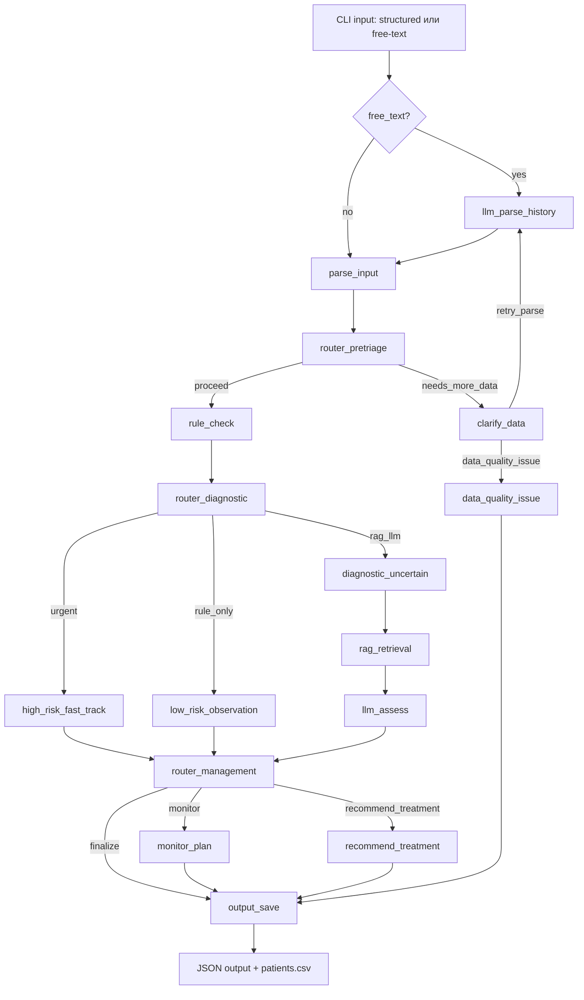
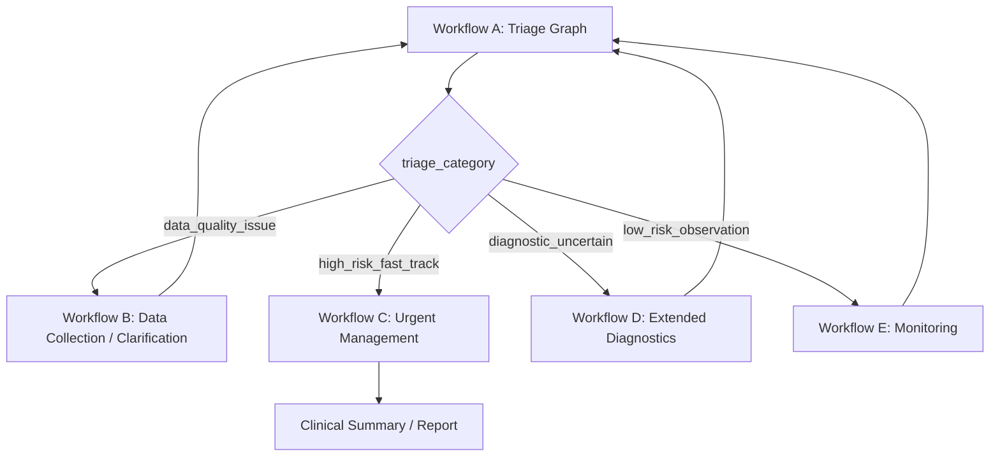

# LangGraph ACS (Console Prototype)

Прототип локальной системы первичной оценки риска ОКС для учебных/исследовательских задач.
Проект запускается из консоли и сохраняет результаты в CSV/JSON.

## Что сделано сейчас

- Консольный запуск: `python -m src.cli.main`.
- Граф на `LangGraph` с многошаговым роутингом:
  - `llm_parse_history` (если `--free-text`)
  - `parse_input`
  - `router_pretriage` + `clarify_data` (цикл уточнений)
  - `rule_check`
  - `router_diagnostic`
  - ветки: `high_risk_fast_track` / `diagnostic_uncertain` / `low_risk_observation` / `data_quality_issue`
  - `rag_retrieval` + `llm_assess` (для неочевидных кейсов)
  - `router_management` + `monitor_plan` / `recommend_treatment`
  - `output_save`
- Три LLM-router узла с полями: `next_step`, `confidence`, `reason`.
- Confidence-gates и fallback-маршрутизация.
- Free-text режим с LLM/эвристическим парсингом анамнеза в структуру.
- Расширенные поля пациента: `age`, `gender`, `spo2`, `creatinine`, `glucose`, `killip_class`, `echo_dkg_results` и др.
- Локальный RAG по `data/guidelines/*.txt` (без vector DB).
- Сохранение истории в `data/patients.csv`.
- A/B режим сравнения двух моделей (`--mode ab`).

## Что пока не сделано

- Web UI.
- Векторный RAG (Chroma/FAISS + embeddings).
- Реальный режим паузы/возобновления кейса (persisted wait-state).

## Архитектура (текущая рабочая)



## Оркестрация между workflow (вертикальная схема для слайда)



## Логика ветвления (кратко)

- `router_pretriage`: данных хватает? (`proceed` / `needs_more_data`)
- `router_diagnostic`: куда после правил? (`urgent` / `rag_llm` / `rule_only`)
- `router_management`: что делать после оценки? (`monitor` / `recommend_treatment` / `finalize`)
- Если `confidence` роутера низкий, включается fallback-ветка (guardrail).

## Модели и зависимости

`requirements.txt`:
- `langgraph`
- `pydantic`
- `pandas`
- `pytest`
- `ollama`

Рекомендуемые модели:
- `qwen2.5:7b-instruct`
- `qwen2.5:3b-instruct`

## Установка

```bash
python -m venv .venv
source .venv/bin/activate  # Windows: .venv\Scripts\activate
pip install -r requirements.txt
python -m src.infrastructure.rag.rag_setup
```

```bash
ollama pull qwen2.5:7b-instruct
ollama pull qwen2.5:3b-instruct
```

## Прямой запуск из корня проекта (python)

### Structured (расширенные поля)

```bash
python -m src.cli.main \
  --mode single \
  --model qwen2.5:7b-instruct \
  --name Ivan \
  --age 67 \
  --gender male \
  --pain-type typical \
  --ecg-changes "ST-depression" \
  --troponin 0.18 \
  --hr 108 \
  --bp 145/90 \
  --spo2 95 \
  --creatinine 145 \
  --glucose 7.8 \
  --killip-class II \
  --echo-dkg-results "ФВ 60%" \
  --symptoms-text "жгучая боль за грудиной" \
  --output data/structured_extended.json \
  --force-llm
```

### Free-text

```bash
python -m src.cli.main \
  --mode single \
  --model qwen2.5:7b-instruct \
  --free-text "Мужчина 67 лет, жгучая боль за грудиной, ST-elevation V2-V5, тропонин 22.712, ЧСС 78, АД 161/89, SpO2 94, креатинин 145" \
  --output data/free_text_result.json \
  --force-llm
```

### A/B

```bash
python -m src.cli.main \
  --mode ab \
  --model qwen2.5:7b-instruct \
  --model-b qwen2.5:3b-instruct \
  --name Ivan \
  --pain-type typical \
  --ecg-changes "ST-depression" \
  --troponin 0.12 \
  --hr 102 \
  --bp 130/85 \
  --symptoms-text "давящая боль в груди 30 минут" \
  --output data/ab_result.json \
  --force-llm
```

PowerShell использует перенос строки через `` ` `` (обратный апостроф), а не `\`.

## Что в выходном JSON

- `risk`, `risk_level`, `explanation`, `record_id`
- `llm_used`
- `parse_confidence`, `missing_fields`
- `route_confidence`, `next_step`, `triage_category`, `route_reason`

## Скрипты

- `./scripts/run.sh` — запуск (single/ab/free-text)
- `./scripts/test.sh` — тесты

## Структура проекта

```text
.
├── data/
│   ├── guidelines/
│   └── patients.csv
├── scripts/
│   ├── run.sh
│   └── test.sh
├── src/
│   ├── cli/main.py
│   ├── core/                 # graph, nodes, prompts, tools, state
│   ├── infrastructure/       # db + rag
│   └── medical/              # rules + scores
├── tests/unit/test_rules.py
├── .env.example
├── .gitattributes
├── .gitignore
├── requirements.txt
└── README.md
```

## Ограничения и дисклеймер

- Это прототип для исследований/обучения, не медицинское изделие.
- Не использовать для реальной диагностики и назначения лечения.
- Любой вывод требует клинической верификации врачом.
